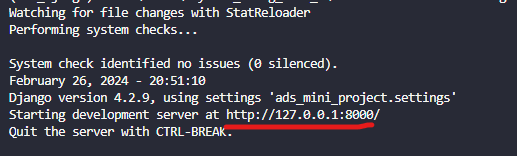
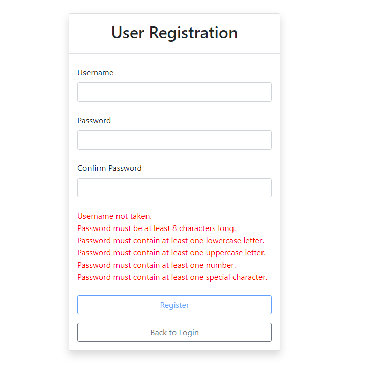
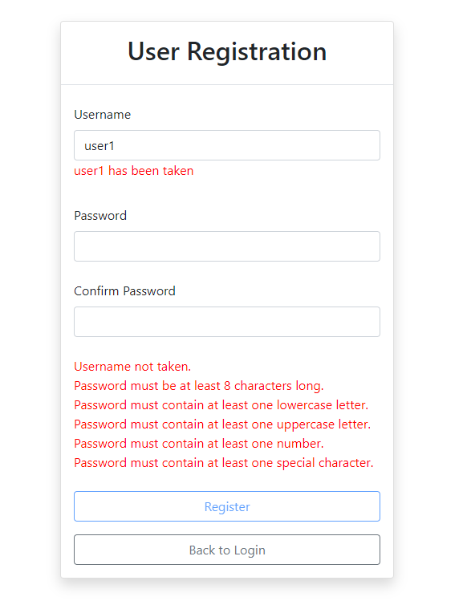
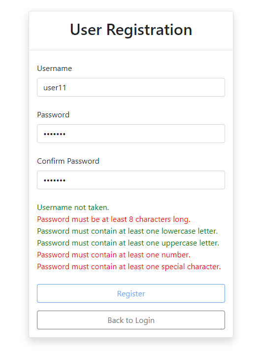
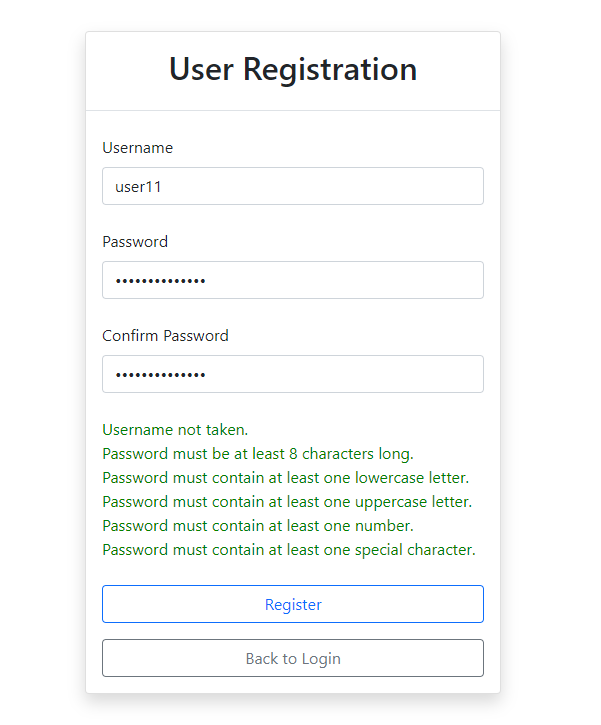
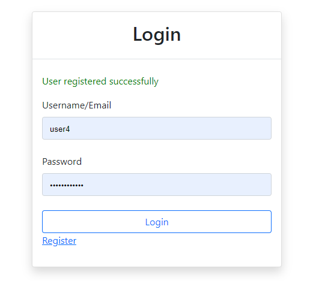
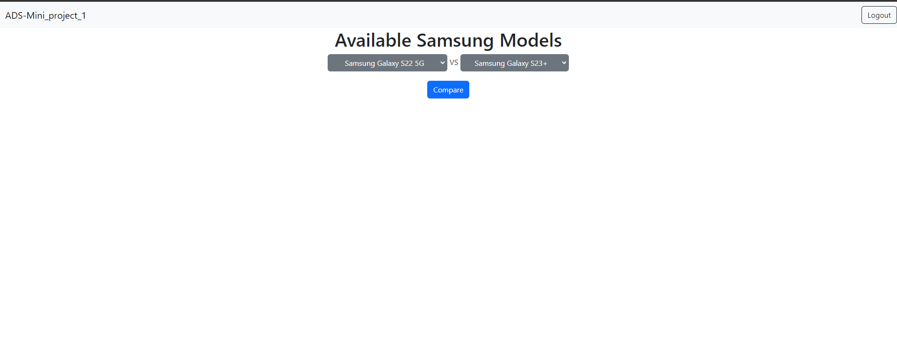
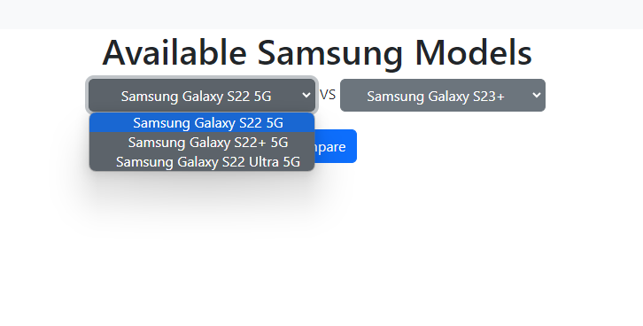
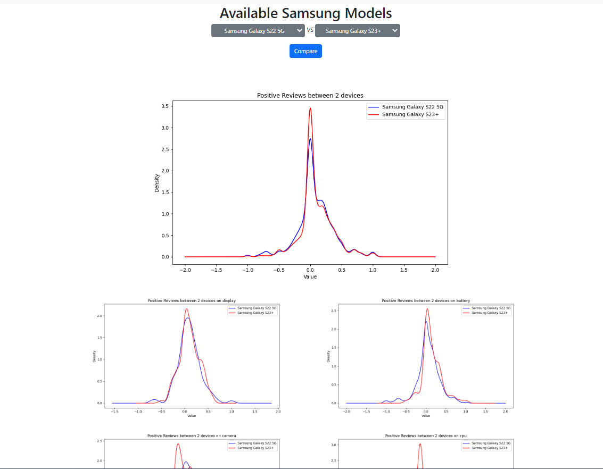

# ADS_Mini_Project: Samsung Mobile Phones review
## Description
This Project is mainly combine of two parts. 
- Data scraping which will scrape mobile phone reviews from https://www.gsmarena.com/ (source code is located at /ads_mini_project/scrapeddata)
- Django project that will perform sentiment analysis and display the figure base on user selected models

---
## Pre-requisites (Data Scraping)
1. Change directory to ads_mini_project/srapedata
2. open the Scrape_Gsm_Arena.ipynb and run the command block.
3. upon successful then all Samsung S22 and S23 user's review data from https://www.gsmarena.com/ will be scraped and store in excel format.
4. 3 Excel files will be genrated and master file is the final product needed for dashboard project.

## Project Setup
1. Create virtual environment using venv or anaconda and activate it.
2. install requirements.txt by executing this command  
    ```pip install -r requirements.txt```
3. cd to the directory that contains manage.py and execute these command for database setup
    ```
    python manage.py makemigrations
    python manage.py migrate
    ```
4. Start the Django application
    ```
    python manage.py runserver
    ```
5. Go to your web browser and enter the URL. The URL you can get it from your terminal
    
 

---


## Screenshots
### Login Page


### User Registration Page


### User Registration Page - Username taken


### User Registration Page - Invalid Password


### User Registration Page - Valid Password 


### User Registration Page - Registration succeeded


### Dashboard


### Dashboard - Models selection


### Dashboard - Figures


### Dashboard - Figures cont
