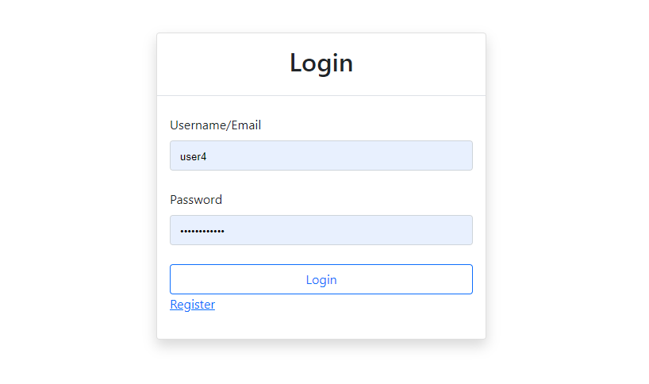
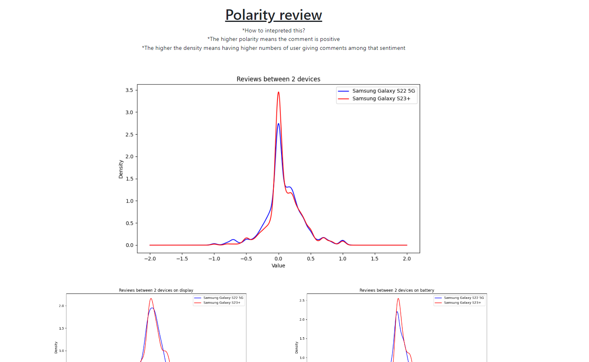
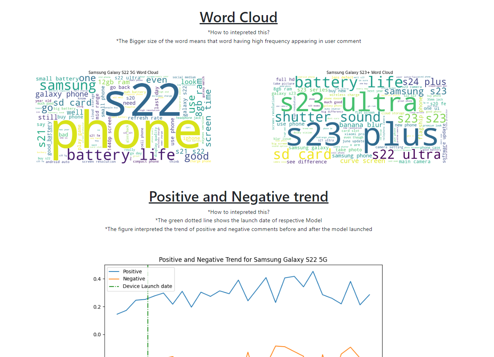

# ADS_Mini_Project: Samsung Mobile Phones review
## Description
This Project is mainly combine of two parts. 
- Data scraping which will scrape mobile phone reviews from https://www.gsmarena.com/
- Django project that will perform sentiment analysis and display the figure base on user selected models

---
## Project Setup
1. Create virtual environment using venv or anaconda and activate it.
2. install requirements.txt by executing this command  
    ```pip install -r requirements.txt```
3. cd to the directory that contains manage.py and execute these command for database setup
    ```
    python manage.py makemigrations
    python manage.py migrate
    ```
4. Start the Django application
    ```
    python manage.py runserver
    ```
5. Go to your web browser and enter the URL. The URL you can get it from your terminal
    
 

---


## Screenshots
### Login Page


### User Registration Page


### User Registration Page - Username taken


### User Registration Page - Invalid Password


### User Registration Page - Valid Password 


### User Registration Page - Registration succeeded


### Dashboard


### Dashboard - Models selection


### Dashboard - Figures


### Dashboard - Figures cont
